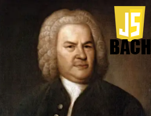

# El doble intèrpret de JSBach



## Extensions
### Configurar el tempo i el compàs

```jsbach
Main |:
    _tm <- {3 4}    ~~~ El compas passa a ser 3/4 ~~~
    _tp <- 120      ~~~ Es toquen 120 negres per minut ~~~
    <:> {C D E F G A B} 
:|
```

### Indicar el tipus de la nota

```jsbach
Main |:
    <:> {C D E F G A B} 
    <:> {C D E F G A B } 8
    <:> {C D E F G A B} {8 8 4 16 16 16 16}
    <:> A
    <:> A 2
:|
```

### Tocar acords

```jsbach
Main |:
    <:> {{A A + 2 A + 4} {B B + 2 B + 4} C}
:|
```